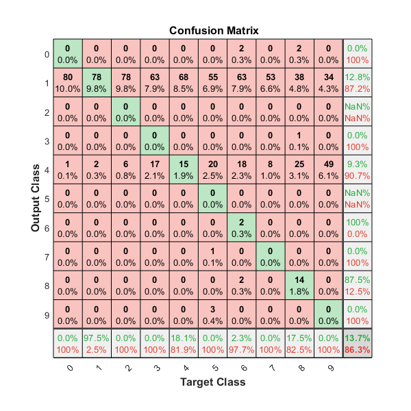
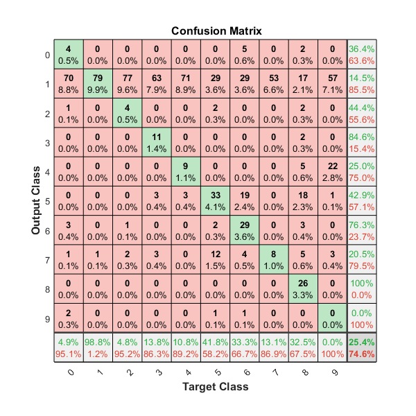
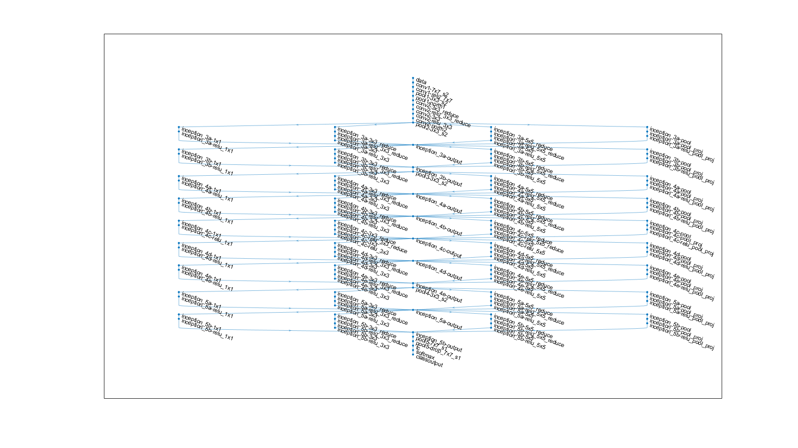
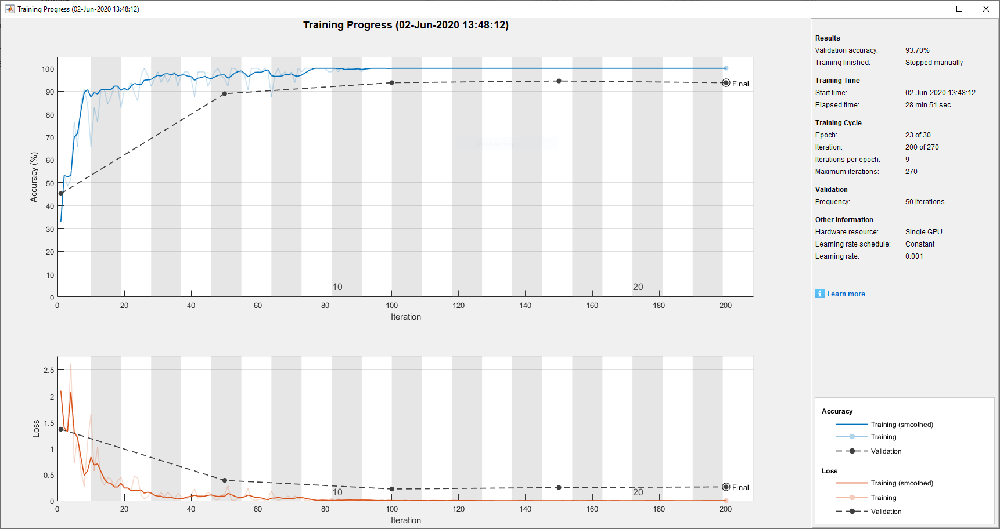

# 1 Identify Handwritten Digits by Manipulator

In this task we evaluate the performance of the model provided in **MNISTModel.mat**. Before we can feed images to the model we need to make sure that the images are in a compatible format and usable for the model. To ensure this we first convert every image to grayscale. Then we resize the smaller dimension of the image to 28px and scale the larger dimension accordingly. In the end the take the 28 x 28 pixel center crop of the image. 

By applying this preprocessing to every image we ensure that every matrix, fed to the model, has the desired size of 28 x 28.

In total we feed 800 self-hand-written numbers to the model. The numbers are written in different colors and different sizes. Most of the time the model misclassifies the digits. The class it assigns the most is the "1".



As the MNIST model was trained with white digits on a white background we also convert our images to a bright digit on a dark background. We do this by calculating the complement of each image. The results are slightly better but still do not lead to an acceptable accuracy.



Regarding the results shown in the confusion matrices above, we assume that the provided model is not capable for real-world uses-cases.


# 2 Transfer Learning in Ground Robot

We Use the google net model pretrained on [ImageNet](http://www.image-net.org) data [GoogLeNet](https://arxiv.org/abs/1409.4842). To perform transfer learning we first replace the last three layers of google net with new layers we want to retrain. As our classification target has only three classes we need to adjust the fully connected layer to output only have three neurons and therefore only output three values. We accomplish this by running the following code:

```matlab
lgraph = replaceLayer(lgraph, 'loss3-classifier', [
    fullyConnectedLayer(numClasses, 'Name', 'fc', 'WeightLearnRateFactor', 20, 'BiasLearnRateFactor', 20)
]);
lgraph = replaceLayer(lgraph, 'prob', [
    softmaxLayer('Name', 'softmax')
]);
lgraph = replaceLayer(lgraph, 'output', [
    classificationLayer('Name', 'classoutput')
]);
```

The next picture shows the newly created model graph.


We also adjust the learning rate of the fully-connected-layer learn to train 20 times faster than the other layers. To train our newly create network we use images from the [MIO-TCD-Classification](http://podoce.dinf.usherbrooke.ca/challenge/dataset/). We only use 300 images taken from each class (cars, pedestrian, motorcycle) to train the model. Before training we resize the images to 224 x 224 pixel to fit the dimensions and make them compatible with the GoogLeNet model. We use a minibatch size of 64 and a learning rate of 0.001.



Due to transfer learning the training process is very fast. The model already learned low level features before and only has to newly learn the classification of those features. We let the model train for 23 epochs and a total of 200 iterations.

| Epoch | Iteration |   Time Elapsed (hh:mm:ss)   |   Mini-batch Accuracy   |   Validation Accuracy   |     Mini-batch Loss     |     Validation Loss     |      Base Learning Rate      |
|----------------------------------------------------------------------------------------------------------------------|----------------------------------------------------------------------------------------------------------------------|----------------------------------------------------------------------------------------------------------------------|----------------------------------------------------------------------------------------------------------------------|----------------------------------------------------------------------------------------------------------------------|----------------------------------------------------------------------------------------------------------------------|----------------------------------------------------------------------------------------------------------------------|----------------------------------------------------------------------------------------------------------------------|
|       1 |           1 |       00:00:23 |       32.81% |       45.19% |       2.0985 |       1.3638 |          0.0010 |
|       6 |          50 |       00:08:14 |       95.31% |       88.89% |       0.1185 |       0.3876 |          0.0010 |
|      12 |         100 |       00:14:53 |      100.00% |       93.70% |       0.0041 |       0.2233 |          0.0010 |
|      17 |         150 |       00:21:53 |      100.00% |       94.44% |       0.0007 |       0.2500 |          0.0010 |
|      23 |         200 |       00:28:47 |      100.00% |       93.70% |       0.0005 |       0.2627 |          0.0010 |

The model reaches a accuracy of 93.70% very quickly. It doesn't improve further though so we stop the training manually after 200 iterations.




# 3 Semantic Segmentation in Aerial Robot

